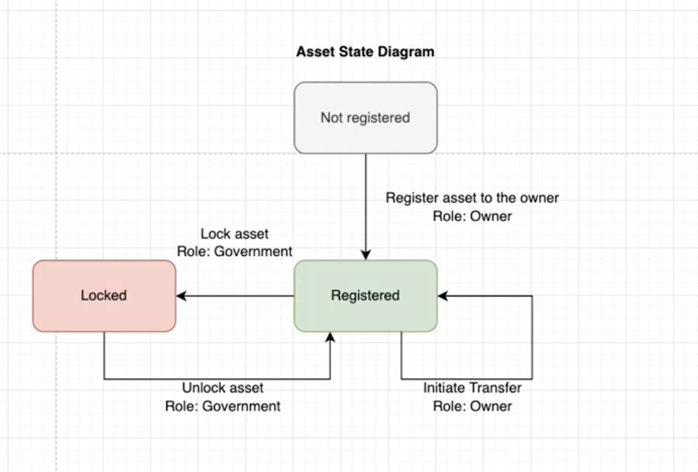

# Blockchain Land Registry

Land registration system using Hyperledger Fabric

### Contributors:

- Ravshan: [LinkedIn](https://www.linkedin.com/in/rmakhmadaliev/) [GitHub](https://github.com/Ravshann)

- Jainam: [LinkedIn](https://www.linkedin.com/in/jainmshah/) [GitHub](https://github.com/naxer-12)

- Hossein: [LinkedIn](https://www.linkedin.com/in/hossein-hesami-5a565b78/) [GitHub](https://github.com/DarioHesami)

- Ramdhani: [LinkedIn](https://www.linkedin.com/in/ramdhaniharis/) [GitHub](https://github.com/rumjuice)

### This project is part of dApp 1 - Enterprise Blockchain assignment

---

## Project Description
This project is an example project in Hyperledger Fabric for land registry use case. The system tries to imitate processes in real life and real estate transfers are at the core of the system. 
## Requirements
The system should have at least 2 types of entities: 
1) Real estate property 
2) Property owner(government, private companies, individuals)

The system should allow locking mechanism of the real estate property by the government, if necessary. If the property is not locked by the government, then it should be tranferable at any moment to any owner entity.  
## State Machine Diagram

TODO: fix the diagram, only govt can register property

We named real estate property as 'asset' objects within the system. This diagram shows all possible states of asset.
## Transition Descriptions
Any asset is unregistered initially. The government should register the asset and set asset owner during the registration. Once registered, owner of the asset can transfer it to another owner entity. Sometimes due to tax problems, law suits and different kinds or sanctions/restrictions government can lock the asset. Locked asset is not transferable by the owner. Only the government can unlock the asset and make it transferable again.  
## State Data Descriptions

## Role Descriptions
Admin - can register all kinds owners, asset, organization.

Government Worker - can register/lock assets and register owners.

Owner - can transfer assets (that belong to them) to another owner.
## Screenshots
TODO